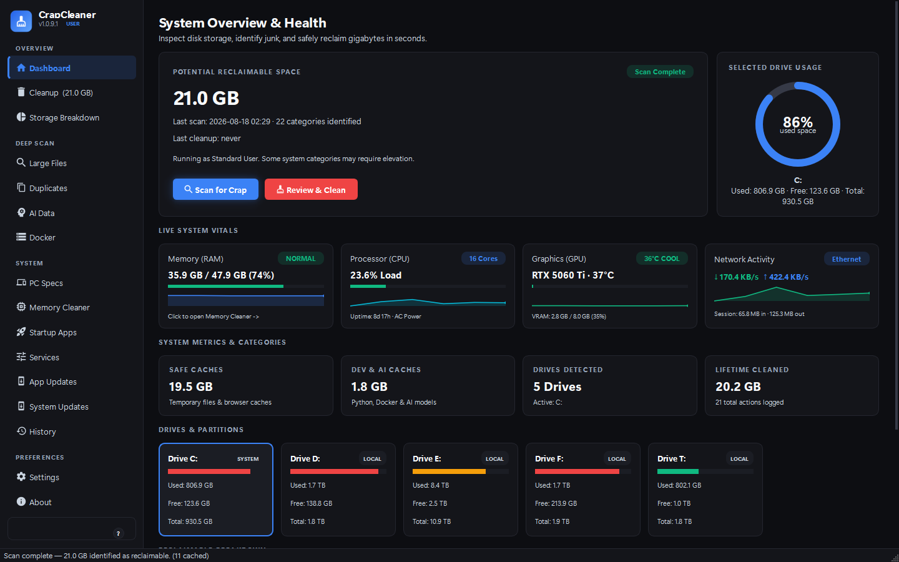
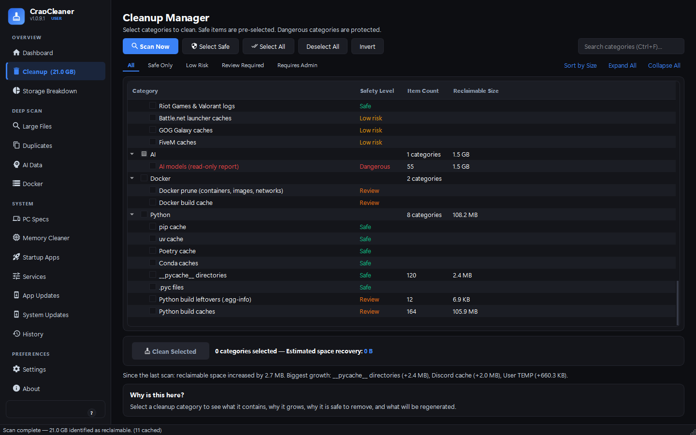
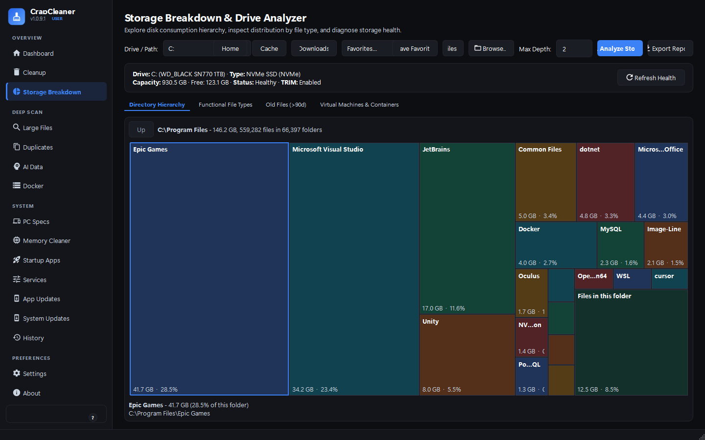
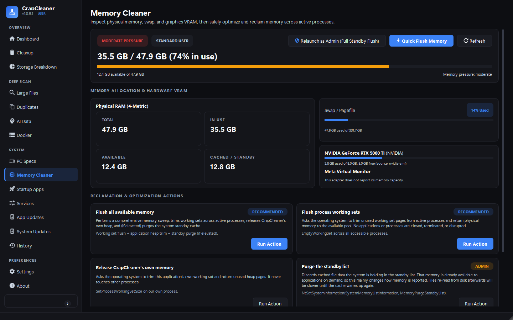
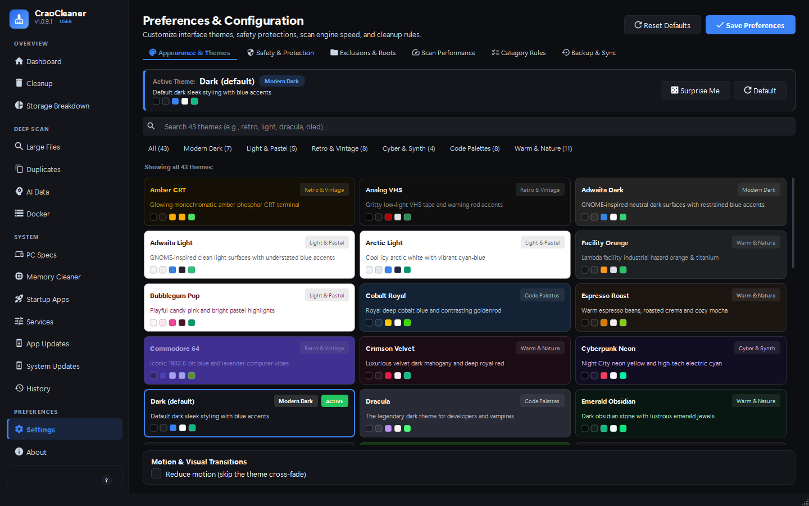

# CrapCleaner

**Disk cleanup and storage analysis for Windows and Linux, that explains itself.**

[](https://github.com/PatrickJnr/crapcleaner/releases/latest)
[](https://github.com/PatrickJnr/crapcleaner/releases)
[](https://github.com/PatrickJnr/crapcleaner/actions/workflows/ci.yml)
[](https://www.python.org/)
[](LICENSE)
[](#platform-support)

### Download

**[Windows (.exe)](https://github.com/PatrickJnr/crapcleaner/releases/latest/download/CrapCleaner.exe)**  ·  **[Linux (x86_64)](https://github.com/PatrickJnr/crapcleaner/releases/latest/download/crapcleaner-linux-x86_64)**  ·  [All releases and checksums](https://github.com/PatrickJnr/crapcleaner/releases/latest)

Portable single files. Nothing to install, no account, no background service, and no
data about you or your machine is sent anywhere. Every cleanup is previewed first and
goes to the Recycle Bin by default, so a mistake is recoverable.



<details>
<summary><b>More screenshots</b></summary>

| Cleanup | Storage Breakdown |
| :--- | :--- |
|  |  |

| Memory | Theme Studio |
| :--- | :--- |
|  |  |

</details>

---

## What it is

A local disk cleaner and storage analyzer. It removes temporary files, build caches,
package-manager stores, browser caches, and application caches, and it shows you where
your disk actually went. It leaves project files, credentials, saves, and documents
alone — and it tells you what it is doing at every step.

It deliberately does **not** do the things that make cleaners untrustworthy: no
registry cleaning, no process killing, no invented RAM or VRAM reclamation, no
"speed up your PC" score.

## Safety

1. **Every target has a reason.** Each category documents what it contains, why it
   grows, why removing it is safe, and what regenerates.
2. **No registry cleaning, ever.** Not cleaning, optimising, defragmenting, or
   repairing — [and here is why](#why-no-registry-cleaner). A test enforces its absence.
3. **You can see every file before it goes.** *Review files…* in the confirmation
   dialog lists the exact paths, and unticking one leaves it alone.
4. **One protected-path layer, on every deletion.** OS directories, document roots,
   `.git` repositories, SSH and GPG keys, browser credential stores, and game saves are
   refused. Manual deletions from the Duplicates and Large Files views go through the
   same check as automated cleanup.
5. **Links are never followed.** Scanning, preview, and cleanup detach symlinks and
   Windows junctions instead of descending through them, so deleting a tree removes the
   link and leaves its target alone.
6. **Reversible by default.** Deletions go to the Recycle Bin or the FreeDesktop Trash
   unless you say otherwise.
7. **Nothing is claimed that did not happen.** A locked file is reported as skipped, a
   scan that hit its file budget says so, and a cleanup with anything left behind is
   never reported as complete.
8. **No telemetry.** No tracking, analytics, or ads, and nothing about you or your
   system is transmitted. The only outbound requests go to GitHub, and only when you
   ask for them: the About page's contributor list, *Check for Updates*, and the
   release download if you accept an update.
9. **Offline mode.** One setting stops all of it — the update check, the contributor
   list, the package-manager queries the Updates view runs, and the hostname lookup on
   the specs page. Anything skipped says it was skipped, rather than failing as though
   the network were down.

---

## Features

### Clean up

Around ninety categories on a typical Windows install, grouped and individually
selectable. Everything is previewed before anything is removed.

| Group | Covers |
| :--- | :--- |
| **Windows** | User and system `TEMP`, CBS servicing logs, Delivery Optimization, font and Cryptnet caches, DirectX and GPU shader caches, Prefetch traces, thumbnail and icon caches |
| **Browsers** | Chrome, Chromium, Edge, Brave, Opera, Opera GX, Vivaldi, Thorium, Arc, Firefox, LibreWolf, Waterfox, Floorp — HTTP, GPU and code caches only. Bookmarks, passwords, history and sessions are untouched, and a running browser produces a warning, never a forced shutdown |
| **Developer tools** | VS Code, Cursor, Windsurf, Zed, JetBrains IDEs, Android SDK, Gradle, Bun, Unity, Godot, Unreal DDC, CMake, sccache, Zig, Docker Buildx (through `docker buildx prune`, never by deleting files) |
| **Project-local caches** | `.ruff_cache`, `.mypy_cache`, `.pytest_cache`, `.tox` inside your configured scan roots. Those four names only, those roots only, no drive-wide sweep |
| **Package managers** | npm, yarn, pnpm, pip, uv, poetry, conda, NuGet, Cargo, Go, Maven, WinGet, Chocolatey, Scoop; APT, DNF, pacman, Flatpak, Snap |
| **Gaming** | Steam, Epic, EA Desktop/Origin, Ubisoft Connect, Battle.net, GOG Galaxy, Riot, FiveM on Windows; Steam (native, `.steam`, Flatpak), Heroic, Lutris and Bottles on Linux |
| **GPU** | NVIDIA, AMD, Intel and Vulkan shader caches on Windows; Mesa shader cache, NVIDIA GL and compute caches, and Steam/Proton shader caches on Linux |
| **AI tools** | Model and inference caches for local AI tooling — reported, never removed without an explicit selection |
| **System** | Recycle Bin / Trash, crash dumps, Windows component store (via DISM, never by hand) |

### Analyse

- **Storage Breakdown** — a proportional grid where each cell's area is its size, so the
  biggest consumers are obvious. Drill in with the mouse or the keyboard; results stream
  in as they are measured rather than after a whole-volume pass, and folders below the
  displayed depth are served from what the scan already measured.
- **By file type** — Videos, Images, Audio, Code, Archives, Documents, Executables,
  Databases, Disk images, AI models.
- **Duplicate finder** — size match, then an 8 KB header hash, then full SHA-256. Keep
  Oldest / Newest / Shortest Path / First, and additional names for one file (hardlinks)
  are reported rather than counted as space you could reclaim.
- **Large files** and **old files**, with the results being the actual largest and
  actual oldest rather than the first found.
- **Installers** left in Downloads and on the Desktop, reported for review.
- **Virtual machines and containers** — WSL2 VHDX, Docker storage, VirtualBox VDI,
  VMware VMDK, Hyper-V VHDX.
- **Recycle Bin / Trash** — recoverable space, item count, oldest and newest entries.
- **Crash dumps** — application dumps and kernel `MEMORY.DMP` files, grouped by the
  application that wrote them. Often the largest single removable file on Windows.
- **A record of every cleanup** — each run writes a manifest of exactly what it removed,
  kept for the last twenty runs. History shows it, and a run that used the Recycle Bin
  offers the exact paths back. The manifest is a list of your own paths: it is never
  logged and never leaves the machine.
- **How fast a category comes back** — "regrows about 400 MB per week", from your own
  run history, so you can stop cleaning things that will be back tomorrow. Where there
  is not enough history it says so rather than showing zero.
- **Changes since last scan** — each storage scan is remembered, so the next one can
  say which folders grew and by how much. This is the answer to "my drive filled up
  this week and I do not know why".
- **On-disk size** — an optional mode that measures what files occupy rather than
  their length, so the totals line up with the free space the OS reports for
  compressed, sparse, and very small files.
- **Reports** — export any of it to JSON, CSV, or TXT.

### System

- **PC Specs** — OS, CPU, motherboard and BIOS, RAM slots, GPU, network interfaces, and
  storage devices, with skeleton placeholders while the queries run.
- **Storage health** — media type (NVMe / SATA SSD / HDD), bus, filesystem, capacity,
  and TRIM status. Cached briefly and shared across views.
- **Live vitals** — network throughput, CPU load, RAM pressure, GPU load, temperature
  and VRAM, with rolling sparklines. A figure the hardware does not expose reads `N/A`,
  never `0`.
- **Memory** — see [Memory, honestly](#memory-honestly).
- **Startup apps** — Registry `Run`/`RunOnce`, Startup folders, and the `StartupApproved`
  flags Task Manager writes on Windows; XDG autostart on Linux, where disabling a
  packaged entry writes a user override rather than deleting a file the package owns.
- **Services** — Windows services through CIM/PowerShell with an `sc.exe` fallback;
  systemd system and user units through `systemctl`. Critical units are protected.
- **System updates** — Windows Update through the `Microsoft.Update` COM API with hotfix
  history; `apt`, `dnf`/`yum`, `pacman` or `zypper` on Linux, with security errata marked
  and reboot-required detection. `0x8024xxxx` codes are translated into plain language.
- **App updates** — `winget` and `chocolatey`; `apt`, `flatpak`, `snap`, `pacman`,
  `dnf`/`yum`. Upgrade one package, a selection, or everything a manager offers.

### Appearance

- **Themes are data, and they reload as you edit them.** Each palette is a JSON file
  in `crapcleaner/assets/themes`; dropping one into `<config dir>/themes` adds a
  theme with no code change. Save the file and the window restyles itself — no
  restart, no reopening. A file missing a colour is skipped with a warning rather
  than breaking start-up, and one naming a category that does not exist is filed
  somewhere reachable instead of disappearing.
- **Save what you make.** *Save to Gallery…* in the Custom Theme Studio turns the
  current colours into a theme of its own: it appears under the **Custom** filter,
  and right-clicking it offers *Show the theme file* and *Delete*. Editing happens
  in the file itself — it reloads as you save. Anything that is not one of the 44
  themes CrapCleaner ships
  is treated as yours — wherever the file sits, and whatever the file claims — so a
  theme you added is always in Custom and always editable.
- **High contrast** as a mode rather than a theme — the palette you are already using,
  routed through the contrast engine at a stricter 7:1 ratio.
- **44 built-in themes** in six families — Modern Dark, Light & Pastel, Retro & Vintage,
  Cyber & Synth, Code Palettes, and Warm & Nature. Every palette is checked against WCAG
  AA contrast for the text and background pairs the interface actually renders.
- **Custom Theme Studio** — pick one colour and get a full palette: a perceptual colour
  engine with hue-dependent lightness compensation, six harmony moods, fifteen presets,
  three sliders, and a randomiser. The preview is a working miniature of the application —
  sidebar, header, figures, a list, badges and buttons — above every palette token with
  its value, and the whole window follows the edit a moment after you stop, so a theme is
  judged on the application rather than on a mockup of it.
- **Start from any theme** rather than from nothing. One saved from the Studio comes back
  exactly as it was saved, because the settings that made it are recorded in the file.
  Anything else has no recipe, so its accent and canvas are taken and the rest generated —
  and the Studio says which of the two it did.
- **Readability, while you design.** Every colour pair the interface actually draws is
  rated against WCAG AA beside the controls. Where one falls short, *Fix* sweeps the
  sliders, takes the combination nearest to what you set, and tells you which ones it
  moved; your accent, canvas and mood are left alone. *Save to Gallery…* turns the result
  into a theme file — which is also how you share it: send the file.
- Themes cross-fade instantly; *Reduce motion* turns the transition off. Material icons
  throughout, no emoji.

### Preferences

Theme gallery, custom studio, safety and protection, exclusions and scan roots, scan
performance, category rules, and backup/sync — all stored in a versioned `config.json`
under the platform config directory. A file that cannot be read is kept as
`config.json.corrupt` rather than silently replaced, and the window tells you.

---

## Platform support

One application that adapts to the system it runs on, rather than a Windows application
with Linux bolted on. A feature whose tooling is missing is hidden, not shown broken —
on a Linux system without systemd the *Services* page does not appear at all. Run
`crapcleaner --capabilities` to see what your system reports.

| Feature | Windows | Linux |
| :--- | :--- | :--- |
| Cleanup, Storage Breakdown, Large Files, Duplicates, AI Data, Docker | Yes | Yes |
| PC Specs, Storage Health, Memory | Yes | Yes |
| Startup Apps | Registry `Run`/`RunOnce`, Startup folders, `StartupApproved` | XDG autostart (`~/.config/autostart`, `/etc/xdg/autostart`) |
| Services | Windows services (CIM/PowerShell, `sc.exe` fallback) | systemd units via `systemctl` |
| System Updates | Windows Update COM, hotfix history | `apt`, `dnf`/`yum`, `pacman`, `zypper` |
| App Updates | `winget`, `chocolatey` | `apt`, `flatpak`, `snap`, `pacman`, `dnf`/`yum` |
| Recycle Bin | Windows Recycle Bin | FreeDesktop Trash (`gio`, `trash-put`, or built-in fallback) |

**How it is built.** A capability registry (`crapcleaner/system/capabilities.py`) is the
single source of truth for what a system supports and what each feature is called there.
Each system feature is a platform-neutral dispatcher over per-platform backends, so
`winreg`, PowerShell and `sc.exe` appear only in `*_windows.py`, and `systemctl`,
`pkexec` and package managers only in `*_linux.py` — enforced by
`tests/test_platform_views.py`. Supporting another OS means adding backend modules and
one registry entry per capability; no caller changes.

**Elevation.** Windows elevates the process through UAC. Linux elevates individual
commands through `pkexec`, so the application never needs to run as root; with no
`pkexec` and no non-interactive `sudo`, the action is refused with an explanation rather
than hanging on a hidden password prompt.

**Linux storage.** Mounts are listed with descriptive names alongside real paths, device
aliases collapse into one entry, pseudo/container/boot mounts are hidden, and scans skip
`/proc`, `/sys`, `/dev`, `/run` and container storage roots.

---

## Install

### The binary (recommended)

From [Releases](https://github.com/PatrickJnr/crapcleaner/releases/latest):

- **Windows x64** — [`CrapCleaner.exe`](https://github.com/PatrickJnr/crapcleaner/releases/latest/download/CrapCleaner.exe). Double-click for the interface, or pass any option below to the same file: `CrapCleaner.exe --scan --json`.
- **Linux x86_64** — [`crapcleaner-linux-x86_64`](https://github.com/PatrickJnr/crapcleaner/releases/latest/download/crapcleaner-linux-x86_64), built against glibc 2.35 (Ubuntu 22.04) so it also runs on newer Debian, Fedora and Arch. `chmod +x` after downloading.

Every release ships `checksums.txt` with SHA-256 sums. Each binary also carries a
build provenance attestation, so you can confirm which commit and workflow produced it:

```bash
gh attestation verify CrapCleaner.exe --repo PatrickJnr/crapcleaner
```

The Windows build is not code-signed, so SmartScreen will warn on first run.

### From source

```bash
git clone https://github.com/PatrickJnr/crapcleaner.git
cd crapcleaner

./scripts/runuv.sh          # uv: set up and run in one step

uv venv && uv pip install -e . && uv run crapcleaner --gui    # uv, manually

python3 -m venv .venv && . .venv/bin/activate                 # pip
pip install -e . && crapcleaner --gui
```

Python 3.10–3.12. The only runtime dependency is PySide6.

---

## Command line

Everything the interface does, scriptable. The same binary serves both: with no
arguments it opens the window, with arguments it runs the command.

Commands read as commands, and every flag below still works exactly as it did:

```bash
crapcleaner scan                        # what could be reclaimed
crapcleaner scan --json                 # the same, machine-readable
crapcleaner preview                     # exactly which files would go
crapcleaner clean --execute             # clean SAFE + LOW_RISK (dry run without --execute)
crapcleaner clean browsers --execute    # or one category by name
crapcleaner storage ~/ --compare        # what grew since the last scan of this path
crapcleaner storage ~/ --allocated      # measure what files occupy on disk
crapcleaner duplicates ~/Downloads --min-dup-size 10MB
crapcleaner update install              # download, verify, install, restart
```

`crapcleaner --help` lists the commands; `crapcleaner <command> --help` explains one.
The original flag spellings (`--scan`, `--clean-safe`, …) are unchanged, so existing
scripts keep working.

| Option | What it does |
| :--- | :--- |
| `--gui` | Open the interface (also the default with no arguments) |
| `--scan`, `--json` | Scan for reclaimable space; machine-readable output |
| `--list-categories` | Every category, its group, and its safety level |
| `--clean-safe`, `--clean-category NAME` | Clean everything safe by default, or a named category. Dry run unless `--execute` |
| `--cleanup-preview` | Full manifest of candidate files before anything runs |
| `--storage [PATH]`, `--file-types [PATH]` | Storage breakdown by folder or by file type |
| `--compare`, `--allocated` | With `--storage`: what changed since the last scan; measure on-disk size |
| `--large-files SIZE`, `--duplicates DIR` | Find big files; find duplicate files (`--min-dup-size` sets the floor) |
| `--installers` | Installers sitting in Downloads and on the Desktop |
| `--recycle-bin`, `--empty-recycle-bin` | Inspect or empty the Recycle Bin / Trash |
| `--disk-health` | Media type, bus, filesystem, TRIM status |
| `--specs` | Hardware and OS specifications |
| `--memory`, `--memory-clean ID` | Memory report; run a memory action (dry run unless `--execute`) |
| `--startup`, `--services`, `--system-updates` | System management through this platform's backend. App updates are a GUI view |
| `--crash-dumps` | Crash and kernel memory dumps, grouped by application |
| `--schedule [status\|enable\|disable]` | The scheduled scan. Scheduled runs never delete anything |
| `--update [check\|install]` | Check for a release, or download, verify, and install it |
| `--diagnostics [--output PATH]` | Write a diagnostics bundle: version, platform, capabilities, drives, and the tail of the log, with paths redacted |
| `--history [--manifest RUN]` | Past runs; what a given run removed |
| `--capabilities` | What this operating system supports |
| `--protected-paths` | The active safety rules |
| `--export FORMAT --output FILE` | Write JSON, CSV or TXT |
| `--progress-jsonl` | Stream progress as JSONL (see below) |
| `--verbose`, `--log-path` | Log detail; print where the log is written |
| `--yes` | Skip the interactive confirmation |

`crapcleaner --help` lists everything.

### Streaming progress

`--progress-jsonl` turns `--scan` and the cleanup commands into a JSONL/NDJSON stream:
one JSON object per line on stdout, no human-readable text mixed in. Without the flag,
normal output is unchanged.

| Event | Emitted when |
| :--- | :--- |
| `scan_start` / `cleanup_start` | the run begins, with the category count |
| `scan_progress` / `cleanup_progress` | a category starts or finishes |
| `category_result` / `cleanup_result` | per-category totals |
| `warning` | a locked file, a permission failure, or a running browser |
| `error` | a category-level failure |
| `cancelled` | the run was interrupted |
| `scan_complete` / `cleanup_complete` | totals; cleanups also report `partial` |

Every object carries `event` and a `time`. A cleanup that could not remove everything
reports `partial: true` and lists what was skipped.

---

## Scheduled scans

A scan can run on a schedule, and a scheduled run **only scans** — it never deletes
anything, because nothing unattended should be able to.

```bash
crapcleaner schedule enable --at 18:00        # daily, at six
crapcleaner schedule enable --frequency weekly --threshold-mb 10240
crapcleaner schedule status
crapcleaner schedule disable
```

The schedule belongs to the operating system: a Task Scheduler entry on Windows, a
systemd user timer on Linux. Nothing of ours runs between scans, the entry is visible
in the tools you already use to audit what runs on your machine, and removing
CrapCleaner does not leave a daemon behind. Results are written to the config
directory and reported when the total is above the threshold you set.

## Updating

*Check for Updates* on the About page, or from the command line:

```bash
crapcleaner update            # is there a newer release?
crapcleaner update install    # download, verify, install, restart
```

The order matters and is deliberate: the release is downloaded, its SHA-256 is checked
against the `checksums.txt` published with it, and the file is confirmed to be an
executable for your platform — **and only then** is the running application replaced.
The previous version is kept as a `.bak` until the new one has started, and if the swap
fails the old one is put back and started instead. A source checkout or a folder
installation is told what to do instead rather than being half-replaced.

---

## Memory, honestly

Windows and Linux manage memory automatically. This view is optional maintenance, not an
optimisation, and CrapCleaner does not claim that freeing RAM or VRAM improves frame
rates or system speed.

Only the actions your kernel can actually perform are listed, and each one names the
exact calls it will make:

| Action | What it really does |
| :--- | :--- |
| **Flush all available memory** | Runs the applicable steps below and reports which ones ran, which were skipped, and why |
| **Flush process working sets** | `EmptyWorkingSet` then `SetProcessWorkingSetSize` on every process this account may open (Windows); `malloc_trim` and a collection (Linux) |
| **Release CrapCleaner's own memory** | `SetProcessWorkingSetSize` on this process only |
| **Purge the standby list** *(Windows, admin)* | `NtSetSystemInformation` with `MemoryFlushModifiedList`, `MemoryEmptyWorkingSets`, `MemoryPurgeStandbyList`, `MemoryPurgeLowPriorityStandbyList`, then `SetSystemFileCacheSize` |
| **Drop the filesystem cache** *(Linux, root)* | `sync`, then `drop_caches` — filesystem cache only |
| **Inspect graphics memory** | Read-only. Nothing is freed, reset, or terminated |

No process is terminated, no priority is changed, and no other application's memory is
touched. The number shown afterwards is the **change in system-wide available memory**,
labelled as such: everything else on the machine allocated and freed during the same
window, so it is not a measure of what the action itself released, and it is not clamped
at zero.

**VRAM, stated plainly.** Graphics drivers expose no public API that lets a desktop
application flush another application's VRAM. CrapCleaner therefore reports capacity and,
where the driver exposes it, live usage — and does not fake a flush. Closing the
application that owns the memory is the only way to release it.

### Why no registry cleaner

Registry cleaners delete shared COM CLSIDs, installer registration keys, and file
association handlers that look orphaned and are not. The failure mode is an application
that stops launching weeks later, or a system that will not boot, with no obvious cause.
There is no measurable performance benefit to offset that. The full argument is in the
in-app Help dialog (`F1`), along with the protected-path architecture and what
regenerates after a cleanup.

---

## Keyboard shortcuts

| Shortcut | Action |
| :--- | :--- |
| `Ctrl+1` … `Ctrl+9`, `Ctrl+0` | Jump to one of the first ten sidebar views, in rail order. Later views are reached from the rail rather than wrapping round and making `Ctrl+1` ambiguous |
| `F1` | Help, safety philosophy, and technical documentation |
| `Ctrl+R` | Start a scan |
| `F5` | Refresh the active view |
| `Ctrl+F` | Focus the search box, where a view has one |
| `Esc` | Cancel the running scan |

---

## Development

```bash
uv pip install -e . && uv pip install -r requirements-dev.txt

pytest                                             # tests
ruff check crapcleaner tests scripts               # lint
ruff format --check crapcleaner tests scripts      # formatting
mypy crapcleaner                                   # types

./scripts/builduv.sh          # build a standalone binary with uv
scripts\build_windows.bat     # or PyInstaller directly, Windows
./scripts/build_linux.sh      # or PyInstaller directly, Linux
```

CI runs the test suite on Windows and Linux across Python 3.10-3.12. Formatting,
linting and type checking run once per push, on Windows and Python 3.12, and the
executable is built and run on both platforms.

### Layout

```
crapcleaner/
  app.py          Entry point: dispatches to the GUI or the CLI
  cli.py          Command line interface
  registry.py     Assembles cleanup categories from every provider
  categories/     Category providers, one module per domain
  core/           Scan and cleanup engine, protected paths, preview, cache
  analysis/       Storage, duplicates, large files, file types, recycle bin
  system/         Specs, health, memory, startup, services, updates
    capabilities.py   What this platform supports, and what it calls things
    backends/         Per-OS implementations
  gui/            PySide6 interface (views, theme, workers, effects)
  models/         Dataclasses for categories, results, and reports
  utils/          Platform helpers, safe file operations, logging, formatting
scripts/          Build helpers, PyInstaller launcher, release checks
tests/            Test suite
```

**Adding a cleanup category**: expose `get_categories()` from a module in `categories/`
and register it in `registry.py`. Give every category its `what_it_contains`,
`why_it_grows`, `why_safe_to_delete`, and `regeneration_behavior` — the interface shows
them, and a category without them is not one users can evaluate.

**Adding platform support**: put the implementation in `system/backends/`, add one entry
per capability in `system/capabilities.py`, and the dispatchers, navigation rail, and CLI
pick it up unchanged.

---

## Contributing

1. Fork, then branch: `git checkout -b feature/new-cleanup-category`.
2. Make sure `pytest`, `ruff check`, `ruff format --check`, and `mypy` all pass.
3. Open a pull request describing what the change does and why it is safe.

Bug reports and category requests have [issue templates](https://github.com/PatrickJnr/crapcleaner/issues/new/choose).
Security issues: see [SECURITY.md](SECURITY.md).

## License

[MIT](LICENSE).
